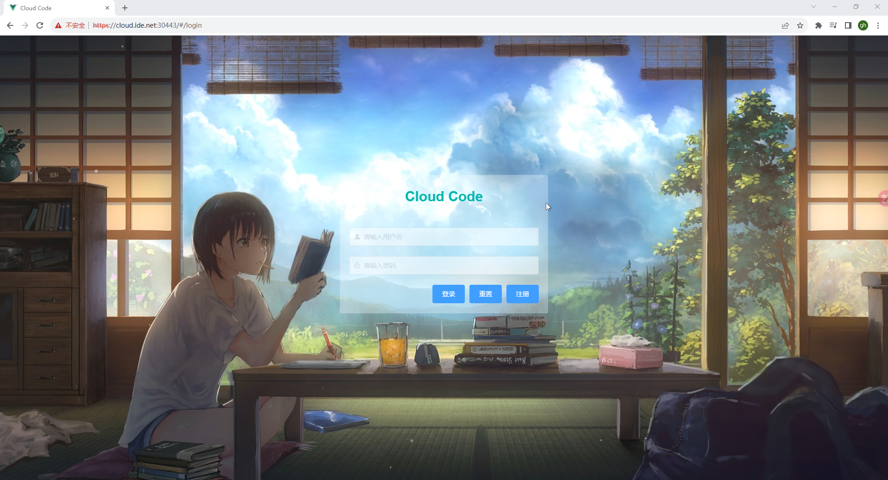

# Cloud IDE

Cloud IDE is a multi-user cloud-based Integrated Development Environment (IDE) management system built on Kubernetes and VS Code Server. It allows you to create and access a VS Code instance in the cloud using a web browser.

## Features

- **Multi-user Support:** Cloud IDE provides a multi-user environment where each user can have their own isolated workspace.
- **Browser Access:** Users can access their IDEs through a web browser, eliminating the need for local installations.
- **VS Code Integration:** Cloud IDE leverages the power of VS Code, providing a rich set of features for code editing, debugging, and extensions.
- **Cloud-based:** The IDE instances are hosted in the cloud, ensuring scalability, availability, and flexibility.
- **Workspace Management:** Cloud IDE offers workspace management capabilities, allowing users to create and manage their projects easily.

## Implementation

| Technology stack | Description                                                                    |
|------------------|--------------------------------------------------------------------------------|
| Kubernetes       | Container orchestration platform for managing and scaling cloud applications   |
| Docker           | Containerization platform for build docker images                              |
| Code-Server      | VS Code in the browser, powered by VS Code Server                              |
| OpenResty        | Service discovery and reverse proxy for workspace and web server reverse proxy |
| Lua              | Used to write service discovery and reverse proxies in Openresty               |
| Kubebuilder      | Framework for building Kubernetes APIs and controllers                         |
| Go               | The primary language used for the Cloud IDE platform                                                            |
| Gin              | Web framework for building API servers in Go                                   |
| gRPC             | High-performance, open-source framework for remote procedure calls             |
| MySQL            | Relational database management system                                          |
| NFS              | For persisting data, such as mysql data, workspace code, and plugins           |
| NFS-CSI-Driver   | Used for automatic PV preparation                                              |
| Vue              | JavaScript framework for building user interfaces                              |

## Architecture

## Display
`Login View：`

`Workspace Template View:`

`Workspace View`

`IDE view`

## Deployment

see [Deployment Guide](deploy/README.md).

## License

Copyright 2023.

Licensed under the Apache License, Version 2.0 (the "License");
you may not use this file except in compliance with the License.
You may obtain a copy of the License at

    http://www.apache.org/licenses/LICENSE-2.0

Unless required by applicable law or agreed to in writing, software
distributed under the License is distributed on an "AS IS" BASIS,
WITHOUT WARRANTIES OR CONDITIONS OF ANY KIND, either express or implied.
See the License for the specific language governing permissions and
limitations under the License.
